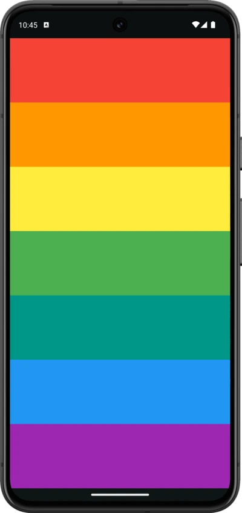

# Xylophone 🎹

## Goal

The goal of this project is to learn about using flutter packages from [pub.dev](https://pub.dev/)

## What I created

A music app that plays Xylophone sounds. For every Beethoven out there, this will let you unleash
your musical talent where ever you are.

## What I learned

- How to incorporate open source libraries of code into your project using Flutter Packages.
- How to play sound on both iOS and Android.
- How to generate repeated user interface Widgets.
- How to use Dart functions that can take input arguments as well as return an output.
- Dart arrow syntax for writing one line functions.

